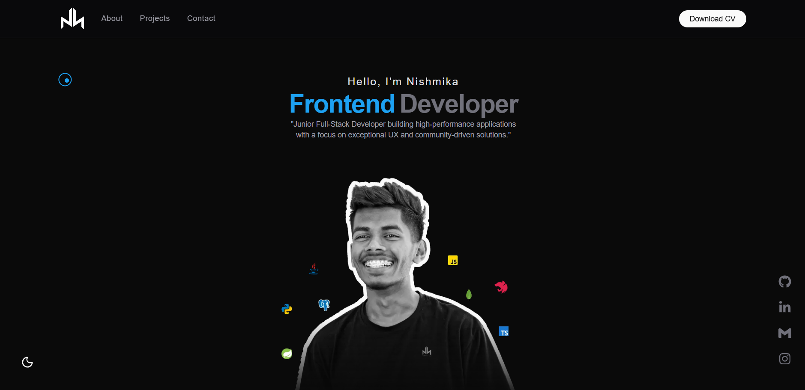

# Portfolio | Nishmika Ekanayaka

A high-performance, minimalist portfolio website built with **Next.js 15**, **TypeScript**, and **Tailwind CSS 4**. Designed to showcase software engineering projects, technical expertise, and professional background.
View portfolio:[here](https://portfolio-nishmikas-projects.vercel.app/) 



## Overview

This portfolio serves as a hub for my software development journey, featuring:
- **Responsive Design**: Optimized for all screen sizes from mobile to wide monitors.
- **Project Showcases**: Detailed views of full-stack applications with live and source code links.
- **Custom Notifications**: Bespoke in-app feedback system built with Framer Motion.
- **Social Integration**: Sidebar for quick access to GitHub, LinkedIn, and more.
- **Smooth Navigation**: Robust custom scroll handling for a seamless user experience.

##  Tech Stack

- **Frontend**: Next.js 15 (App Router), React 19, Framer Motion
- **Styling**: Tailwind CSS 4, Lucide & React Icons
- **Form Handling**: Formspree API with custom validation
- **Theming**: Dark/Light mode support via `next-themes`

##  About Me

I am Nishmika Ekanayaka, a 3rd-year BICT Undergraduate at the University of Sri Jayewardenepura (CGPA: 3.50). I specialize in building scalable, user-centric full-stack applications.

- **Frontend**: React, Next.js, HTML5, CSS3, JavaScript/TypeScript
- **Backend**: Node.js, Express, NestJS, Socket.IO
- **Database**: MongoDB, PostgreSQL
- **Tools**: Git, Docker, Spring Boot

## 🔧 Installation & Setup

To run this project locally, follow these steps:

1. **Clone the Repository**:
   ```bash
   git clone https://github.com/nishmikaeka/portfolio.git
   cd portfolio
   ```

2. **Install Dependencies**:
   ```bash
   npm install
   ```

3. **Environment Setup**:
   Create a `.env.local` file in the root directory and add your Formspree Form ID (required for the contact form):
   ```env
   NEXT_PUBLIC_FORMSPREE_FORM_ID=your_form_id_here
   ```

4. **Run the Development Server**:
   ```bash
   npm run dev
   ```
   Open [http://localhost:3000](http://localhost:3000) in your browser.

## 📬 Contact

- **Email**: [nurannishmika22@gmail.com](mailto:nurannishmika22@gmail.com)
- **GitHub**: [nishmikaeka](https://github.com/nishmikaeka)
- **LinkedIn**: [Nishmika Ekanayaka](https://www.linkedin.com/in/nishmika-eka/)

---
*Built with ❤️ by Nishmika*
